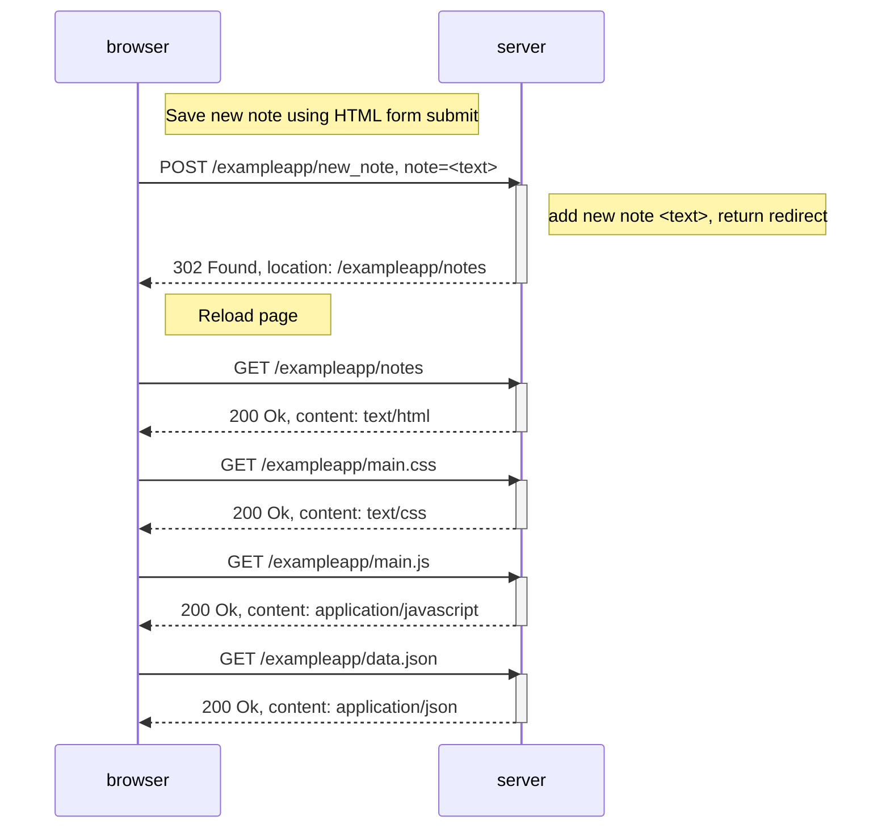

```mermaid
sequenceDiagram

    Note right of browser: Save new note using HTML form submit

    browser->>server: POST /exampleapp/new_note, note=<text>
    activate server
    Note right of server: add new note <text>, return redirect
    server-->>browser: 302 Found, location: /exampleapp/notes
    deactivate server

    Note right of browser: Reload page

    browser->>server: GET /exampleapp/notes
    activate server
    server-->>browser: 200 Ok, content: text/html
    deactivate server

    browser->>server: GET /exampleapp/main.css
    activate server
    server-->>browser: 200 Ok, content: text/css
    deactivate server

    browser->>server: GET /exampleapp/main.js
    activate server
    server-->>browser: 200 Ok, content: application/javascript
    deactivate server

    browser->>server: GET /exampleapp/data.json
    activate server
    server-->>browser: 200 Ok, content: application/json
    deactivate server

```