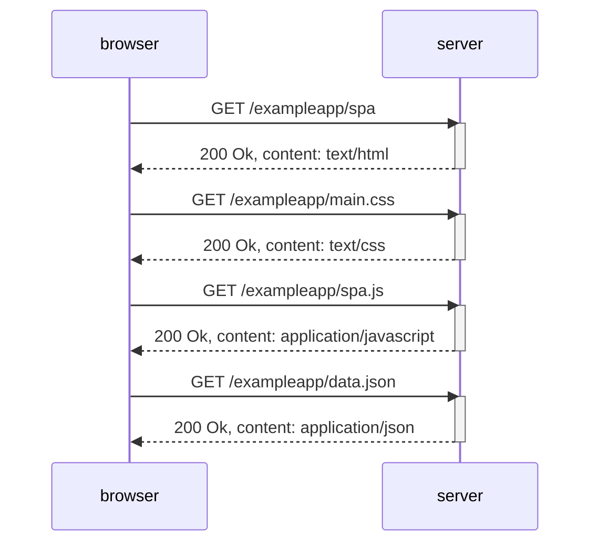

```mermaid
sequenceDiagram

    browser->>server: GET /exampleapp/spa
    activate server
    server-->>browser: 200 Ok, content: text/html
    deactivate server

    browser->>server: GET /exampleapp/main.css
    activate server
    server-->>browser: 200 Ok, content: text/css
    deactivate server

    browser->>server: GET /exampleapp/spa.js
    activate server
    server-->>browser: 200 Ok, content: application/javascript
    deactivate server

    browser->>server: GET /exampleapp/data.json
    activate server
    server-->>browser: 200 Ok, content: application/json
    deactivate server
```