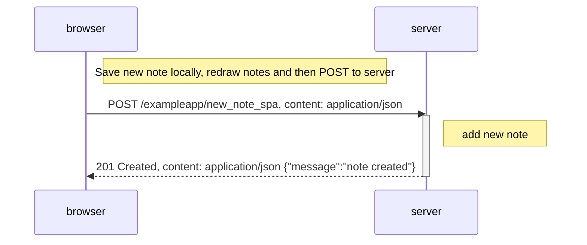

```mermaid
sequenceDiagram

    Note right of browser: Save new note locally, redraw notes and then POST to server

    browser->>server: POST /exampleapp/new_note_spa, content: application/json
    activate server
    Note right of server: add new note
    server-->>browser: 201 Created, content: application/json {"message":"note created"}
    deactivate server
```